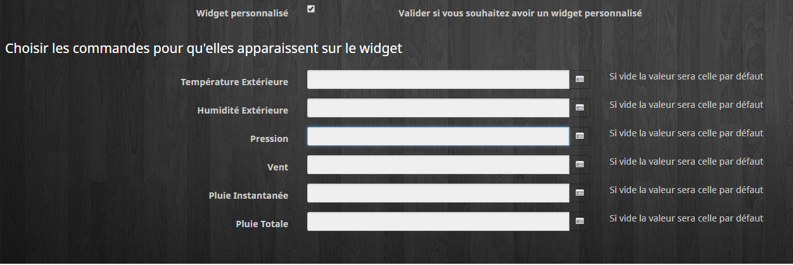

Description 
===

Plugin permettant de récupérer la météo du jour et des 4 jours suivant.

Le plugin récupère les informations via le site www.prevision-meteo.ch
[ici](https://www.prevision-meteo.ch)

Configuration
===

> Pour configurer le plugin, aller sur le site https://www.prevision-meteo.ch.

> Sélectionner votre ville via la barre de recherche.

> Vous arrivez sur une page type 

> https://www.prevision-meteo.ch/meteo/localite/paris

> Dans le configuration de l’équipement mettre "paris".

De nombreuses commandes sont disponibles (voir Liste des paramètres retournés par le flux JSON)
[ici](https://www.prevision-meteo.ch/uploads/pdf/recuperation-donnees-meteo.pdf)

**Autres commandes**

rain_0 rain_1 rain_2 rain_3 rain_4 : Cumul de la pluie sur la journée (en mm) 
 
 
Les widgets
=========

Le Widget par défaut
---

>  Lorsque la température est égale ou inférieure à 10 °C le windchill est indiqué. Lorsque les températures dépassent 20 °C l'humidex est indiqué ==> [ici](https://fr.wikipedia.org/wiki/Indice_humidex)

Un clic sur l’icône graph du widget et des  infos apparaissent dans une autre fenêtre

Le Widget personnalisable
---

Dans la configuration de l'équipement , cocher Widget personnalisé et enregistrer.

Ensuite vous pouvez définir les commandes que vous souhaitez voir sur le widget

