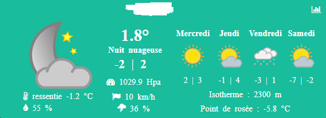
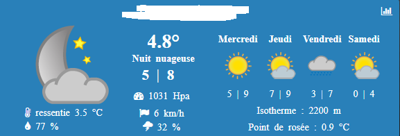
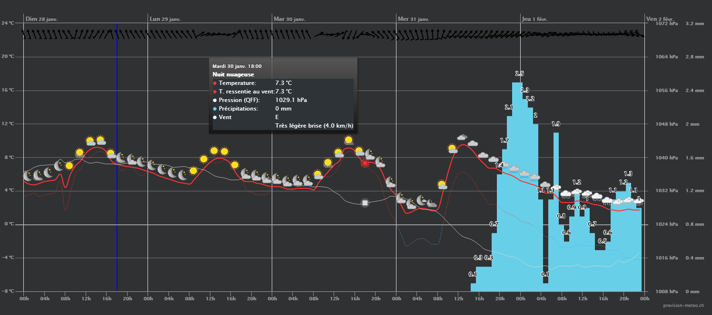

Description 
-----------

Plugin permettant de récupérer la météo du jour et des 4 jours suivant.

Le plugin récupère les informations via le site www.prevision-meteo.ch
[ici](https://www.prevision-meteo.ch)

Le widget
---------

Un clic sur l’icône graph du widget et des  infos apparaissent dans une autre fenêtre

Configuration
=============

> Pour configurer le plugin, aller sur le site https://www.prevision-meteo.ch.
>\
> Sélectionner votre ville via la barre de recherche.\
> Vous arrivez sur une page type \
> https://www.prevision-meteo.ch/meteo/localite/paris
> dans le configuration de l’équipement mettre "paris".\

De nombreuses commandes sont disponibles (voir le chapitre json)
[ici](https://www.prevision-meteo.ch/uploads/pdf/recuperation-donnees-meteo.pdf)

